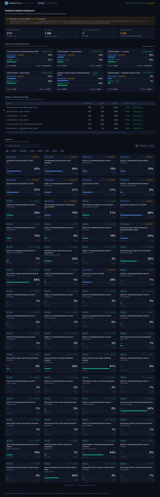
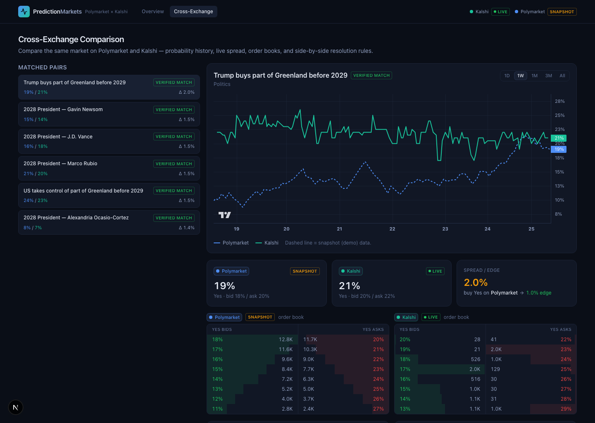
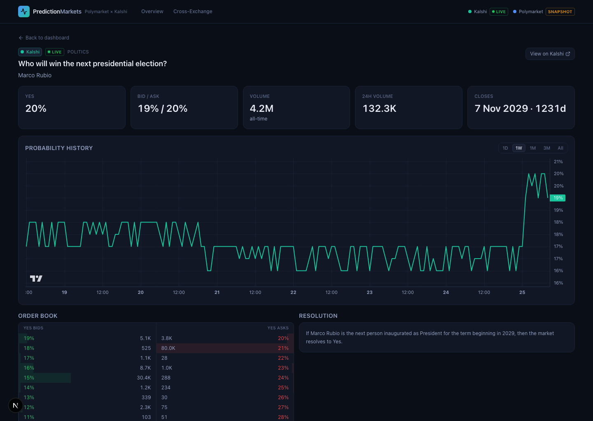

# Prediction Markets Dashboard — Polymarket × Kalshi

A real-time visualization dashboard for prediction markets. It pulls live odds from
**Kalshi** and **Polymarket**, normalizes them into one model, and lets you **compare the
same real-world market across both exchanges** — probability-over-time charts, live
cross-exchange spreads, a **depth- and fee-aware arbitrage engine**, a **resolution-divergence
layer** that flags when a "matched" market actually settles differently, and a **real-time
(WebSocket) order book**.



## Features

- **Cross-exchange comparison** — the same market priced on Polymarket vs Kalshi, with a
  dual-line probability chart (1D · 1W · 1M · 3M · All; default 1D), live spread, fee-adjusted
  edge, both venues' order books, and resolution rules side by side.
- **Depth-aware fillable arbitrage** — not a top-of-book illusion. The engine walks *both*
  order books level by level until the edge collapses, applies Kalshi's non-linear taker fee,
  and reports the **fillable size, net profit, ROI, and ROI annualized by resolution date**.
  It compares bid-vs-ask (never mid-vs-mid), so an "8-point gap" correctly reads as the
  ~0.8%/yr it actually is once you cross spreads, pay fees, and lock capital for years.
- **Resolution-divergence flags** — the most important precision feature. An LLM equivalence
  judge read each matched event's *actual* resolution text and flagged where the two venues
  would pay differently. Example: the 2028-President market resolves on who is **inaugurated**
  (Kalshi) vs the **AP/Fox/NBC race call** (Polymarket) — so an arbitrage "lock" can in fact
  **lose both legs** if the winner dies/withdraws before inauguration. Surfaced as a panel, a
  per-pair ⚠ flag, and a red warning on the arb panel.
- **Real-time order book** — Polymarket's book streams **tick-by-tick** over a server-side
  WebSocket bridged to the browser via SSE; the ladder animates and flashes on every change.
  (Kalshi's WS needs API auth, so it uses a fast 2s animated poll.)
- **Spread / arbitrage radar** — matched pairs ranked by cross-exchange divergence; net edge is
  only surfaced for **verified** matches with positive depth-aware net edge, with divergence flags.
- **Full market browser + search** — thousands of markets across both venues, server-side sorted
  and filtered, with infinite scroll; search hits each venue so you can pull up any market.
- **Graceful, per-venue degradation** — each venue reports its own status (`LIVE` / `SNAPSHOT` /
  `OFFLINE`) and the UI keeps working if one source is unreachable.

| Cross-exchange comparison | Market detail |
|---|---|
|  |  |

## Tech stack

- **Next.js 15** (App Router) + **TypeScript** + **Tailwind CSS v4**
- **TanStack Query** for client data/cache, polling, and dedupe
- **lightweight-charts** (probability time series) + **recharts** (depth chart / sparklines)
- **ws** for the server-side Polymarket order-book WebSocket; **Server-Sent Events** to the browser
- Server-side **route handlers** proxy every upstream call — this hides keys and sidesteps CORS
  (Kalshi returns `403` to any browser `Origin`; the browser only ever talks to `/api/*`).

## Data sources

| Job | Source | Notes |
|---|---|---|
| Market discovery, prices | Kalshi `/events?with_nested_markets`, Polymarket Gamma `/markets` | public, no auth |
| Probability history | Kalshi `/candlesticks`, Polymarket CLOB `/prices-history` | 1-minute floor (both APIs cap there) |
| Order book (poll) | Kalshi `/orderbook`, Polymarket CLOB `/book` | full-depth ladder |
| Order book (stream) | Polymarket CLOB WebSocket `book` + `price_change` | tick-by-tick, server→SSE→browser |
| Optional aggregation | PolyRouter | only with an API key |

All prices are normalized to **probabilities in `[0,1]`** (Kalshi `*_dollars`/`*_fp` fixed-point;
Polymarket's JSON-encoded `outcomes`/`outcomePrices`/`clobTokenIds`). History is resampled onto a
**shared uniform time grid** per range so the chart's index-based time axis is uniform and exact.

## Cross-exchange matching

Matching is the core of the product, in three layers (`lib/aggregate.ts` → `lib/match.ts`):

1. **Event-level alignment** (`lib/events.seed.ts` + `lib/entities.ts`) — a registry maps a
   Polymarket event to a Kalshi series, then aligns their outcomes by **entity**. Persons and
   countries match on a canonical name + alias table (AOC, RFK, J.D.↔JD Vance, USA↔United
   States…); teams match by **token overlap**, so Kalshi's "Sacramento" lines up with
   Polymarket's "Sacramento Kings" and "LA Clippers" isn't confused with the Lakers — no
   per-team roster needed. Covers the **2028 elections** (President + party nominees), the
   **2026 World Cup** (`KXMENWORLDCUP`, ~46 countries), the **NBA** (`KXNBA`, 30) and the
   **NHL** (`KXNHL`, 32) — **~108 sports pairs**. The Kalshi series is **fetched directly**
   (not from the corpus), so a series below the top-volume pages still gets its full field.
   Adding another league is one registry line (a Kalshi series + a Polymarket event slug).
2. **IDF-weighted fuzzy fallback** — for everything else, weighted token overlap with guard
   rails: same category, a **question-type guard** (rejects "who will *win*" vs "who will *run*"
   vs "*nominee*"), and a number/year guard (rejects "≥25bps" vs "50bps").
3. **Resolution-equivalence judge** (`lib/divergence.ts`) — an LLM read both venues' resolution
   text per matched event and classified them `equivalent` / `minor` / `divergent`, extracting
   the concrete cases where they'd pay differently. Results are baked in (rules change rarely).

A spread is never presented as tradeable arbitrage unless the match is `verified`, the
depth-aware net edge is positive, and the divergence flag is shown alongside it.

## Polymarket reachability (e.g. India / DNS blocks) — solved with DoH

Polymarket is **DNS-blocked on some networks** (it's banned in India, where ISP DNS refuses to
resolve `*.polymarket.com`). The block is **DNS-only** — the servers and their TLS/SNI are
reachable — so the app resolves Polymarket via **DNS-over-HTTPS** (`lib/doh.ts`, Cloudflare by
default) and connects straight to the IP, server-side, with the correct SNI/Host. This applies to
both the REST fetches and the order-book **WebSocket**. **Live Polymarket data works with no VPN
and no proxy**, controlled by `POLY_DOH` (default `auto`):

- `auto` — try direct DNS, transparently fall back to DoH on failure (a no-op where DNS works)
- `on` — always use DoH for Polymarket
- `off` — never; use the snapshot fallback instead

The full resolution chain is **direct DNS → DoH → PolyRouter (if `POLYROUTER_API_KEY` set) →
labeled snapshot**. If everything fails, the snapshot (`mode: "snapshot"`, dashed lines, amber
badges) keeps the UI working. Kalshi is **live** out of the box and needs no key.

> Note: Polymarket's ban in India applies to *trading*; this dashboard only reads public
> market-price data. Comply with your local regulations.

## Getting started

```bash
npm install
npm run dev          # http://localhost:3000
```

The corpus + cross-exchange pairs are **prewarmed at server boot** (`instrumentation.ts`) and
kept warm, so the first page load is fast rather than paying the ~17s cold build on your click.

Optional configuration — copy `.env.example` to `.env.local`:

```bash
POLYROUTER_API_KEY=            # optional — enables PolyRouter fallback for Polymarket
POLY_DOH=auto                 # auto | on | off  (DNS-over-HTTPS for Polymarket)
POLY_GAMMA_URL=               # optional — override Polymarket Gamma host
POLY_CLOB_URL=                # optional — override Polymarket CLOB host
KALSHI_BASE_URL=              # optional — override Kalshi base
POLY_SNAPSHOT=on              # set to "off" to disable the demo snapshot fallback
```

```bash
npm run build && npm run start   # production
```

## Architecture

```
instrumentation.ts     boot hook: prewarm + keep-warm the corpus/pairs cache
app/
  api/                 server route handlers (proxy + normalize + cache)
    markets · market/[venue]/[id] · history · orderbook/[venue]/[id] · quote
    pairs · arb · search · stats · status · stream/orderbook/[venue]/[id] (SSE)
  page.tsx             overview (stats, spotlight, spread table, market grid)
  compare/             cross-exchange comparison
  market/[venue]/[id]/ single-market detail
lib/
  types.ts             normalized Market / PricePoint / Orderbook / MarketPair / Divergence
  kalshi.ts            live Kalshi provider (events, candlesticks, orderbook) — SWR corpus
  polymarket.ts        Polymarket provider (Gamma/CLOB → PolyRouter → snapshot) — SWR corpus
  polyws.ts            Polymarket order-book WebSocket manager (over DoH) → SSE
  doh.ts               DNS-over-HTTPS resolver for DNS-blocked upstreams
  aggregate.ts         corpus → cross-exchange pairs (cached, stale-while-revalidate)
  events.seed.ts       event registry (Polymarket event ↔ Kalshi series)
  entities.ts          person/team canonicalizer + alias table
  match.ts             IDF-weighted matcher with question-type / number guards
  arb.ts               depth-aware fillable arbitrage (walk books, fees, annualized ROI)
  divergence.ts        LLM-judged resolution-equivalence per event + lookup
  series.ts            resample irregular price points onto a uniform time grid
  http.ts              fetch with timeout + jittered backoff, never sends Origin
  hooks.ts / api.ts    TanStack Query hooks (incl. useLiveOrderbook SSE) + typed client
components/             charts, cards, tables, order book, divergence panel, header
```

### Performance / freshness

- **Live tip**: charts update via `series.update()` and the order book streams over SSE, so
  only the moving point/level repaints — your zoom/pan is never disrupted.
- **Cold start**: the heavy corpus+pairs build is prewarmed at boot and refreshed before its
  TTL; the corpus and pairs caches are **stale-while-revalidate**, so only the very first build
  ever blocks a request — later expirations serve instantly and rebuild in the background.
- **Caching**: route handlers set `s-maxage` hints; quotes ~3s, order book ~2s (poll) / live
  (stream), history 60s, pairs/corpus cached with in-flight dedup.

## Notes & limitations

- **Granularity**: 1-minute is the floor on both venues' history APIs (Kalshi rejects any
  candlestick period except 1/60/1440-min; Polymarket `fidelity` is whole minutes). Sub-second
  history isn't served by either; the live order book / quote provide finer real-time movement.
- **Kalshi WebSocket** needs API-key auth (REST market data is public, WS is not), so Kalshi's
  book uses a 2s animated poll; add `KALSHI_API_KEY` + request signing to enable its WS.
- Polymarket "volume" is USD; Kalshi "volume" is contract count — labeled per card, not converted.
- The snapshot dataset is **illustrative demo data**, not live prices.
- Probabilities are market-implied and **not financial advice**.
```
